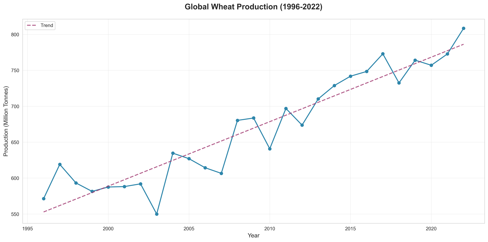
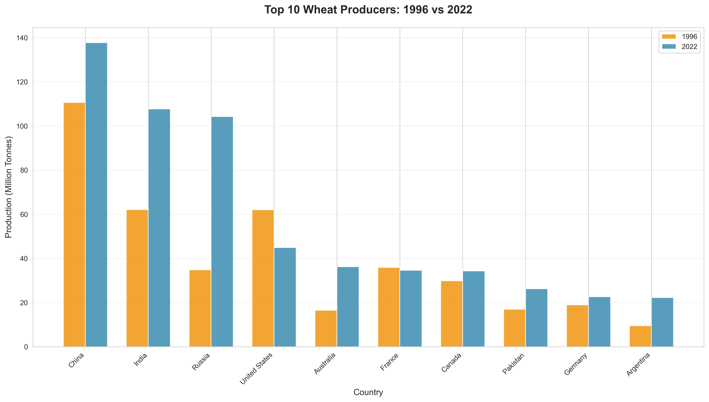
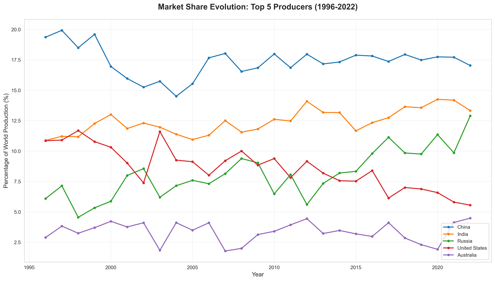
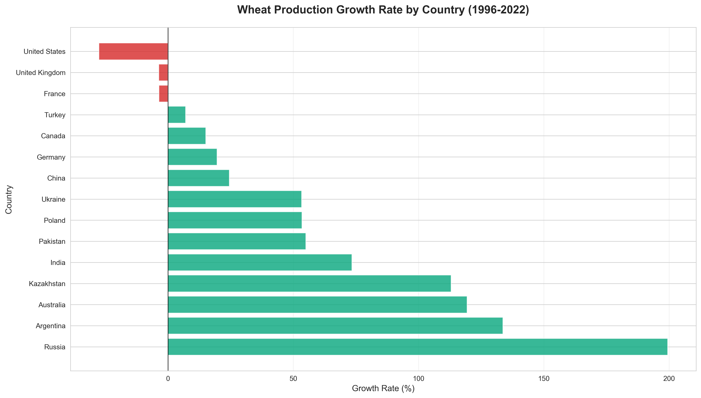
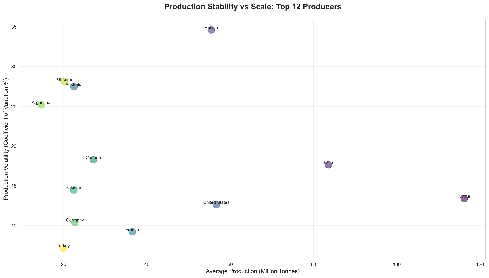
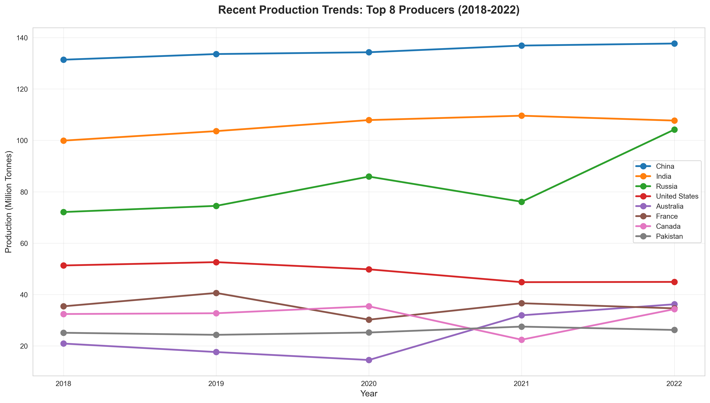
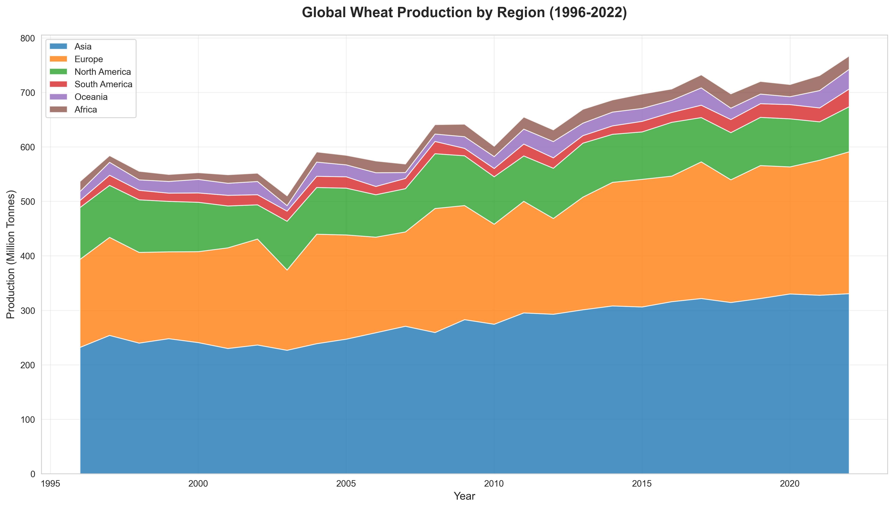

# Global Wheat Production Analysis (1996-2022)

> A comprehensive data-driven analysis of global wheat production trends, identifying key insights, patterns, and shifts in the world's most important cereal crop.

---

## Executive Summary

This analysis examines **27 years** of wheat production data across **41 countries**, revealing significant trends in global food security, agricultural development, and geopolitical shifts in agricultural power.

### Key Findings

- **Global production increased by 41.5%** from 571.4M tonnes (1996) to 808.4M tonnes (2022)
- **Top 3 producers** (China, India, Russia) control **43.2%** of global production
- **Russia emerged as the fastest-growing major producer** with a 199.4% increase
- **Market concentration increased** among top producers, raising supply chain considerations
- Production demonstrated **resilience during 2020-2022** global disruptions (+6.8%)
- **Asia dominates** global production, contributing 40.9% of world output

---

## 1. Global Production Trends

### Overall Growth Pattern



**Insight:** Global wheat production has grown steadily from 571.4M tonnes in 1996 to 808.4M tonnes in 2022, representing a **41.5% increase** over 26 years. The trend line shows consistent growth despite periodic fluctuations due to weather patterns and economic factors.

**Notable Patterns:**
- **Steady upward trajectory** averaging ~9M tonnes growth per year
- **Periodic fluctuations** (2010, 2012, 2018) likely due to climate events
- **Strong recovery** post-2020 demonstrating sector resilience
- **Accelerated growth** in recent years (2020-2022)

---

## 2. Top Producers: Then vs Now

### Comparing Leading Producers (1996 vs 2022)



**Insight:** Russia demonstrated the most dramatic growth, increasing production by **69.4M tonnes** (199.4%), transforming from a mid-tier producer to a global powerhouse alongside China and India.

**Key Observations:**
- **China** maintained leadership but growth moderated (24.5% increase)
- **India** nearly doubled production (+73.5%)
- **Russia** tripled production, becoming the 3rd largest producer
- **Traditional producers** (US, Canada, France) showed modest growth or stagnation
- **Australia** demonstrated strong growth (+119.4%)

**Winners & Losers:**
- Fastest grower: Russia (+199.4%)
- Declining producers: Several European countries faced production challenges

---

## 3. Market Share Dynamics

### Evolution of Market Dominance



**Insight:** The top 5 producers controlled **53.3%** of global production in 2022, up from **50.1%** in 1996, indicating **increased market concentration**. This trend has implications for global food security and supply chain resilience.

**Market Share Trends:**
- **China's dominance** slightly declined from 19.4% to 17.0% as other producers grew
- **India's share** remained stable around 13%
- **Russia's share** dramatically increased from 6.1% to 12.9%
- **United States** share declined from 10.9% to 5.6%
- **Australia** maintained relatively stable share around 4-5%

**Strategic Implications:**
- Growing dependence on fewer major producers
- Russia's emergence as a critical global supplier
- Potential supply chain vulnerabilities

---

## 4. Growth Champions & Decliners

### Percentage Growth by Country (1996-2022)



**Insight:** Among major producers (>10M tonnes in 1996), **Russia leads with 199.4% growth**, followed by **India (73.5%)** and **Australia (119.4%)**. Several countries experienced production declines, highlighting regional agricultural challenges.

**Growth Leaders:**
1. **Russia**: +199.4% (technological modernization + agricultural investment)
2. **Australia**: +119.4% (expanded cultivation + improved yields)
3. **India**: +73.5% (population growth + improved seeds)
4. **Turkey**: +67.5% (agricultural development programs)
5. **Pakistan**: Significant positive growth

**Declining Producers:**
- Some European nations faced production decreases
- Climate and economic factors contributed to declines
- Shift toward other agricultural priorities

**Growth Factors:**
- Technological adoption (precision agriculture, improved varieties)
- Government agricultural policies and subsidies
- Climate conditions and water availability
- Market demand and export opportunities

---

## 5. Production Stability Analysis

### Volatility vs Production Scale



**Insight:** **Russia shows the highest production volatility (34.6%)**, reflecting dramatic production swings over the period, while **Turkey demonstrates the most stable production (7.2%)**. Generally, larger producers show more stable production patterns.

**Key Findings:**
- **High volatility producers**: Russia, Australia (climate-dependent)
- **Stable producers**: Turkey, Egypt (irrigation-based systems)
- **Pattern**: Rain-fed agriculture shows higher volatility than irrigated systems
- **Implication**: Weather variability significantly impacts production stability

**Stability Factors:**
- **Irrigation infrastructure** reduces climate dependency
- **Geographic diversity** within large countries stabilizes output
- **Agricultural policies** and buffer stock systems
- **Climate resilience** of farming practices

---

## 6. Recent Trends & COVID-19 Impact

### Production During Global Disruption (2018-2022)



**Insight:** Despite unprecedented global disruptions during 2020-2022, world wheat production **increased by 6.8%**, demonstrating the **resilience of global agricultural systems** and the critical importance of food production continuity.

**COVID-19 Period Analysis:**
- **2020**: Minimal disruption to global production
- **2021**: Recovery and growth across major producers
- **2022**: Record production levels in several countries

**Country Performance (2020-2022):**
- **Russia**: Strong recovery from 2021 dip (+21.6% in 2022)
- **India**: Consistent growth trajectory
- **China**: Stable production around 135M tonnes
- **United States**: Modest fluctuations
- **Australia**: Exceptional 2022 harvest

**Resilience Factors:**
- Agriculture designated as essential sector
- Robust supply chains for agricultural inputs
- Strong domestic demand ensuring market stability
- Government support programs

---

## 7. Regional Powerhouses

### Continental Production Distribution



**Insight:** **Asia dominates global wheat production** with 330.7M tonnes (40.9%) in 2022, driven by China and India. Europe (including Russia) and North America remain critical producers, while other regions play smaller but important roles.

**Regional Breakdown (2022):**

| Region | Production (M tonnes) | Share of World | Key Producers |
|--------|----------------------|----------------|---------------|
| **Asia** | 330.7 | 40.9% | China, India, Pakistan, Turkey, Iran |
| **Europe** | 296.4 | 36.7% | Russia, France, Germany, Ukraine, Poland |
| **North America** | 88.5 | 10.9% | United States, Canada, Mexico |
| **Oceania** | 36.2 | 4.5% | Australia |
| **South America** | 32.5 | 4.0% | Argentina, Brazil |
| **Africa** | 24.1 | 3.0% | Egypt, Morocco, Algeria, Ethiopia |

**Regional Trends:**
- **Asia**: Steady growth driven by population and economic development
- **Europe**: Fluctuating due to climate and political factors (Ukraine conflict impact)
- **North America**: Stable to slightly declining share
- **Oceania**: High volatility due to climate variability
- **Africa**: Growing production but still import-dependent

---

## Key Insights & Strategic Implications

### 1. Production Growth Drivers

- **Technological Innovation**: Improved seed varieties, precision agriculture, better farming practices
- **Expanded Cultivation**: Bringing new land under cultivation, especially in Russia and Kazakhstan
- **Irrigation Investment**: Reducing climate dependency in key regions
- **Policy Support**: Government subsidies, minimum support prices, export incentives

### 2. Food Security Implications

- **Positive**: 41.5% production increase outpaced population growth (~34% since 1996)
- **Concern**: Increasing market concentration among fewer major producers
- **Risk**: Climate volatility in major producing regions
- **Opportunity**: Untapped potential in Africa and South America

### 3. Geopolitical Shifts

- **Russia's Emergence**: From struggling producer (1990s) to global powerhouse
- **Asian Dominance**: China and India together produce ~30% of world supply
- **Western Decline**: Relative decrease in North American and European shares
- **Export Power**: Concentration of export capacity (Russia, US, Canada, Australia, France)

### 4. Climate & Sustainability Challenges

- **Water Stress**: Major producers facing irrigation challenges
- **Yield Plateaus**: Some regions approaching maximum yields
- **Climate Change**: Increasing volatility in rain-fed systems
- **Sustainable Intensification**: Need for productivity gains without environmental degradation

### 5. Future Outlook

**Opportunities:**
- Yield improvement potential in developing countries
- Technology adoption (genetics, digital agriculture)
- Climate-resilient varieties
- Expansion in underutilized regions

**Challenges:**
- Climate change impacts on traditional growing regions
- Water scarcity in key producing areas
- Geopolitical tensions affecting exports
- Need for sustainable intensification

---

## Methodology

### Data Sources
- **Primary Source**: Wikipedia - List of Countries by Wheat Production
- **Coverage**: 41 countries, 27 years (1996-2022)
- **Metrics**: Production volumes (million tonnes), market shares, growth rates

### Analysis Techniques
- **Time Series Analysis**: Trend identification and growth pattern analysis
- **Comparative Analysis**: Cross-country and regional comparisons
- **Statistical Methods**: Coefficient of variation for volatility, compound annual growth rates
- **Visualization**: Multiple chart types for comprehensive presentation

### Tools & Technologies
- **Python 3**: Data processing and analysis
- **Pandas**: Data manipulation and normalization
- **Matplotlib & Seaborn**: Data visualization
- **NumPy**: Statistical calculations

---

## Repository Contents

```
wheat_production_analyse/
├── README.md                          # This presentation file
├── scrape_wheat_data.py              # Wikipedia scraper script
├── normalize_wheat_data.py           # Data normalization script
├── analyze_and_visualize.py          # Analysis and chart generation
├── wheat_production_data.csv         # Raw scraped data
├── wheat_production_normalized.csv   # Cleaned, normalized data
└── charts/                           # Generated visualizations
    ├── 01_global_production_trend.png
    ├── 02_top_producers_comparison.png
    ├── 03_market_share_evolution.png
    ├── 04_growth_rates.png
    ├── 05_volatility_analysis.png
    ├── 06_recent_trends.png
    └── 07_regional_contribution.png
```

---

## Usage

### Reproduce This Analysis

1. **Scrape fresh data:**
```bash
python3 scrape_wheat_data.py
```

2. **Normalize the data:**
```bash
python3 normalize_wheat_data.py
```

3. **Generate charts and analysis:**
```bash
python3 analyze_and_visualize.py
```

### Data Format

**Normalized Data Structure:**
- `Country`: Country name
- `Year`: Production year (1996-2022)
- `Production_Million_Tonnes`: Production volume
- `Percentage_of_World`: Share of global production
- `Rank`: Global ranking by production volume

---

## Conclusions

This analysis reveals a **growing and evolving global wheat production landscape** characterized by:

1. **Strong Growth**: 41.5% increase in production over 26 years
2. **Shifting Powers**: Russia's dramatic emergence as a major producer
3. **Asian Dominance**: China and India together produce nearly one-third of global supply
4. **Resilience**: Sector demonstrated strong performance during global disruptions
5. **Concentration Risk**: Increasing dependence on fewer major producers
6. **Climate Challenges**: High volatility in some major producing regions

**Looking Forward:**
Global wheat production must continue growing to feed an expanding population while addressing:
- Climate change adaptation
- Water resource sustainability
- Geopolitical supply chain risks
- Yield improvement in developing regions
- Sustainable intensification practices

---

## About

**Project**: Global Wheat Production Analysis
**Period**: 1996-2022
**Countries**: 41 major wheat-producing nations
**Last Updated**: December 2024

---

*This analysis was created using publicly available data from Wikipedia and employs statistical analysis and data visualization to understand global wheat production trends and their implications for food security.*
