# Moscow Residential Real Estate Market — Business Insight Report

> **Source:** Cian.ru — Russia's leading real estate marketplace
> **Scope:** Apartments for sale, Moscow region
> **Dataset:** 1,500 active listings · March 2026

---

## Executive Summary

The Moscow apartment-for-sale market presents a wide and deeply segmented landscape. With a median listing price of **40 million RUB** and a mean of **97 million RUB**, the gap between these two figures reveals a small number of ultra-premium listings pulling the average sharply upward — a critical signal for any business operating in this market. 2-room and 3-room apartments dominate supply, monolith construction commands premium pricing, and free-sale transactions remain the dominant deal structure. Mortgage availability is concentrated in the affordable segment, leaving the luxury market largely cash-driven.

---

## 1. What Is Being Sold — Supply by Apartment Type

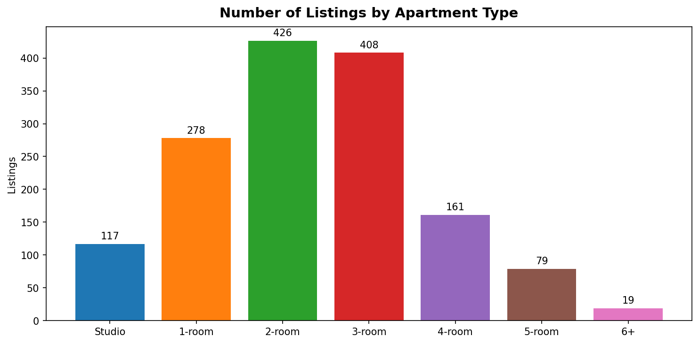

**2-room (426) and 3-room (408) apartments together account for 56% of all listings.** 1-room units represent a strong secondary segment at 278 listings, while studios (117) occupy a smaller but growing niche. Large apartments (4+ rooms) are present but thin in supply.

**Business implication:**
The market is oriented toward family-sized units. Developers, agents, and mortgage lenders should weight their product portfolios toward 2-3 room units. Studios, while growing in demand from young professionals and investors, remain a minority of available stock.

---

## 2. Price Ladder — How Price Scales with Apartment Size

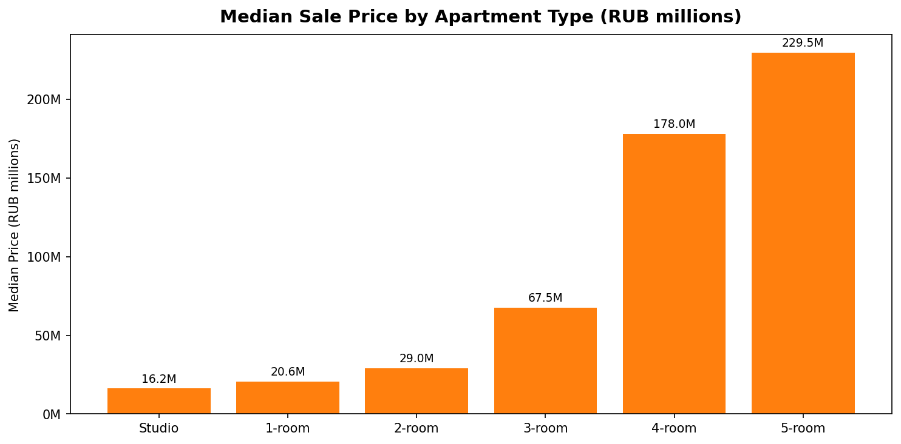

Median prices rise steeply with room count:
- **Studio:** ~14M RUB
- **1-room:** ~21M RUB
- **2-room:** ~29M RUB
- **3-room:** ~68M RUB
- **4-room:** ~178M RUB
- **5-room:** ~230M RUB

The jump from 2-room to 3-room is particularly sharp (+134%), reflecting a fundamental quality threshold in the Moscow market — 3-room apartments are often in premium buildings.

**Business implication:**
For lenders, the 1-2 room segment is the accessible tier where mortgage products are most applicable. The 3-room+ segment shifts toward cash-heavy, premium buyers requiring a different advisory and financing approach.

---

## 3. Value Per Square Meter — Where You Get the Most for Your Money

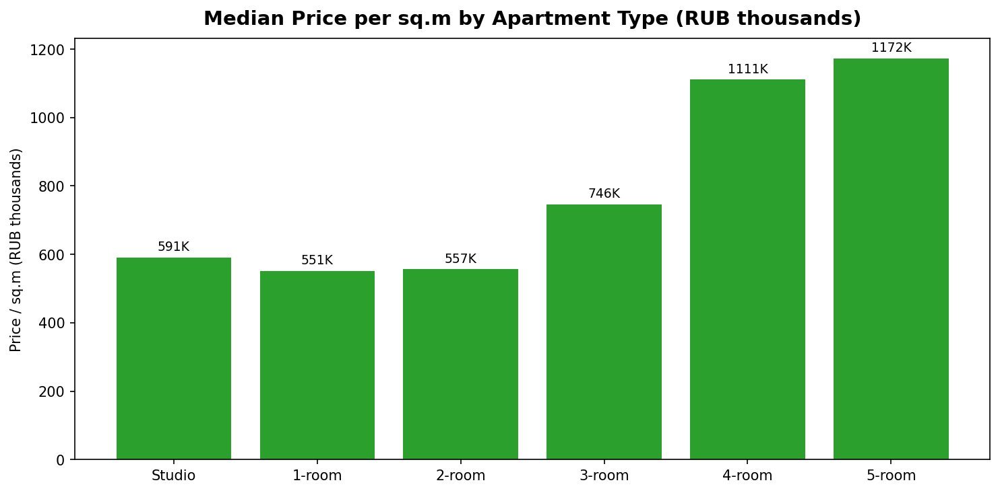

Price per square meter is **highest in 1-room and studio apartments** and decreases as units get larger. This is a well-established market dynamic: larger apartments come at a lower per-meter cost but a higher absolute price.

**Business implication:**
Investors purchasing for rental yield should note that smaller units offer a higher price-per-meter entry point but also command higher per-meter rents. Buyers seeking capital value growth may find larger apartments a more efficient purchase per unit of space.

---

## 4. Building Quality — What the Market Is Built On

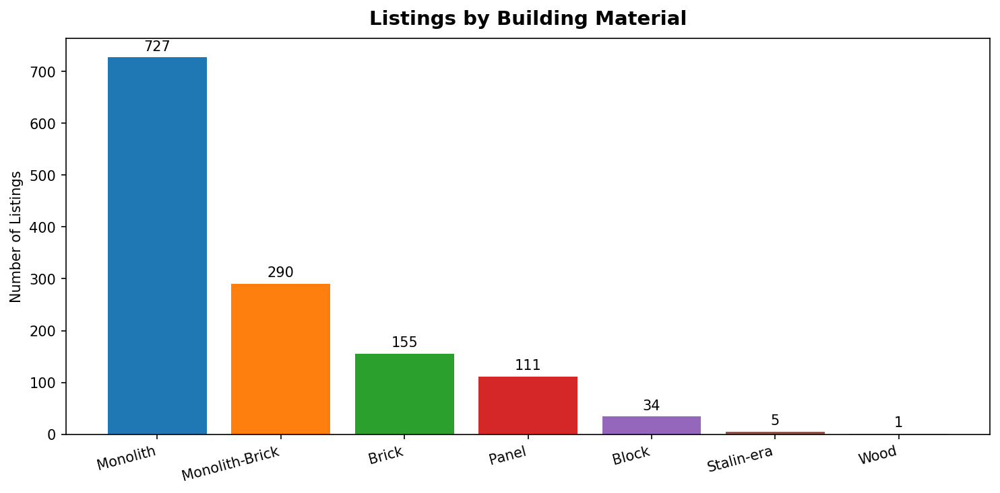
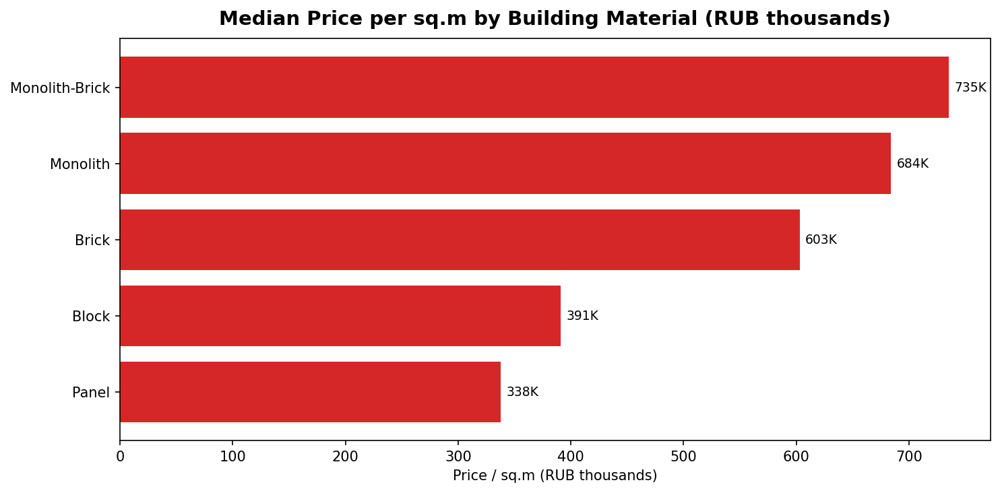

**Monolith construction dominates** at 727 listings (48%), followed by Monolith-Brick (290, 19%) and Brick (155, 10%). Panel buildings — the Soviet-era housing stock — account for only 111 listings (7%).

Price per square meter by material tells the quality story clearly:
| Material | Median Price/sqm |
|---|---|
| Monolith-Brick | 735,000 RUB |
| Monolith | 684,000 RUB |
| Brick | 603,000 RUB |
| Block | 391,000 RUB |
| Panel | 338,000 RUB |

Panel buildings trade at less than **half** the per-meter price of monolith-brick — a 54% discount.

**Business implication:**
Valuers, lenders, and insurers must calibrate assessments strictly by building material. Panel buildings carry significantly lower collateral value. For developers, monolith-brick construction is the clear market premium — a strong signal for new project specifications.

---

## 5. Price Range — Where the Volume Is

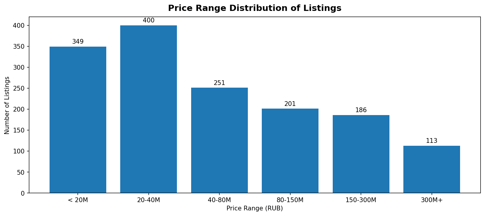

The distribution is right-skewed:
- **55% of listings are priced between 20M and 80M RUB** — the core market
- The sub-20M segment has 221 listings (15%) — entry-level/small units
- The 300M+ ultra-premium segment has 171 listings (11%)

The median (40M RUB) is far below the mean (97M RUB), confirming that a small group of high-value listings significantly distorts the average.

**Business implication:**
The 20–80M RUB band is where the market is most liquid and competitive. Agents and lenders should concentrate acquisition and origination efforts here. The 300M+ segment requires specialist handling — deals are infrequent, buyers are sophisticated, and standard mortgage products don't apply.

---

## 6. Floor Level — Where Buyers Are Looking

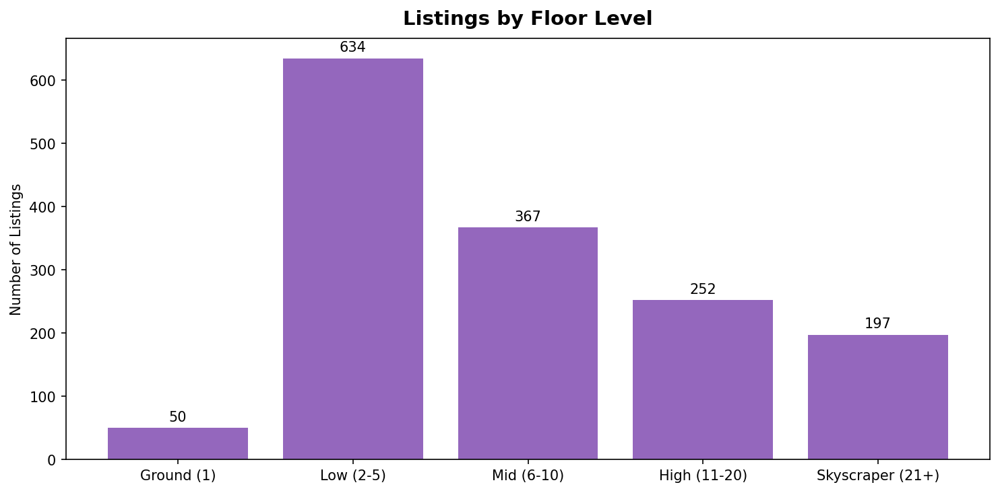
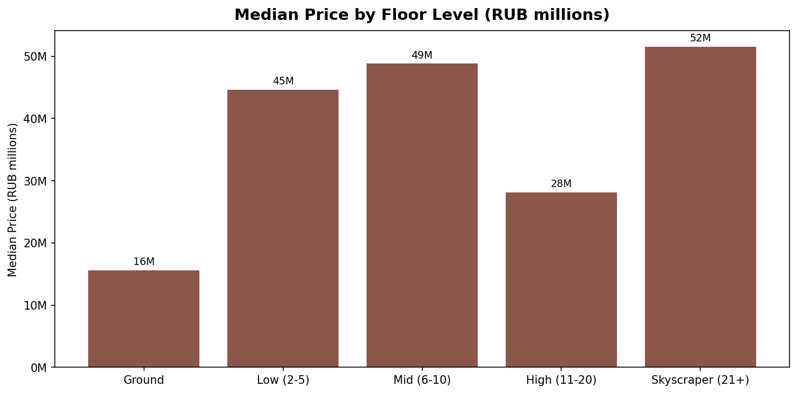

The **2-5 floor tier holds 634 listings (42%)** — the most popular segment, favored for accessibility and natural light without extreme height. Ground floor (floor 1) has the fewest listings at just 50 (3%).

Median prices rise with height:
- Ground floor: ~22M RUB
- Low (2-5): ~30M RUB
- Mid (6-10): ~38M RUB
- High (11-20): ~52M RUB
- Skyscraper (21+): ~100M RUB

**Business implication:**
Ground-floor apartments are deeply discounted and difficult to finance or resell. High-rise and skyscraper floors command a clear premium, typically in newer luxury developments. Appraisal and pricing models must account for floor-level as a significant value driver.

---

## 7. How Apartments Are Sold — Deal Structure Breakdown

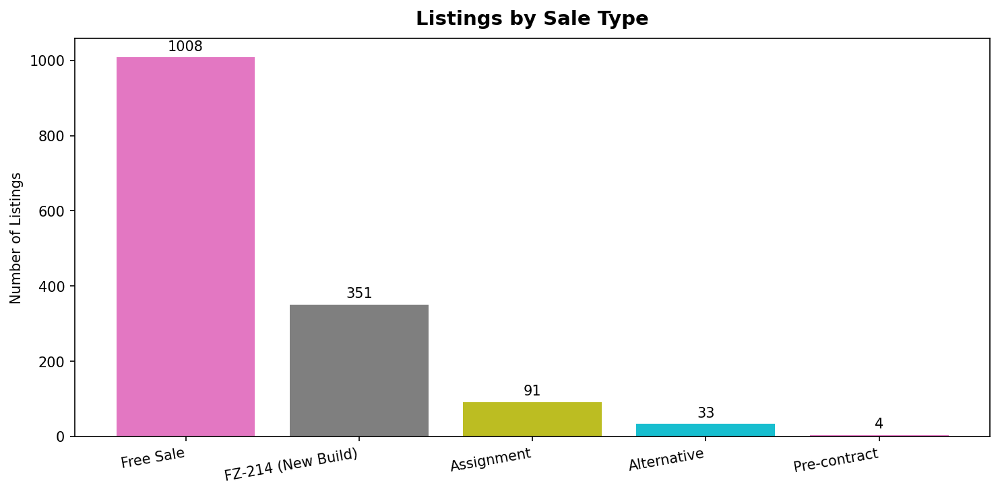
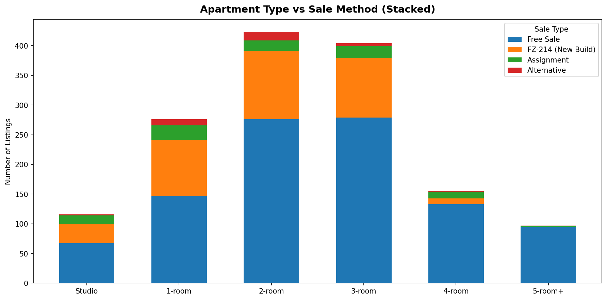

**"Free Sale"** dominates at 1,008 listings (67%) — standard secondary market transactions. **FZ-214** (developer pre-sales with legal buyer protections) accounts for 351 listings (23%), reflecting the continued strength of new-build demand. Assignment deals (91 listings, 6%) represent investors re-selling developer contracts before completion.

The stacked chart reveals that Free Sale transactions span all room sizes evenly, while FZ-214 is concentrated in 1-3 room apartments — consistent with new-build developments offering standardised unit types.

**Business implication:**
Legal teams, title companies, and mortgage providers must be equipped for FZ-214 deals, which have distinct documentation and risk profiles. Assignment transactions require additional due-diligence capacity. The dominance of Free Sale means secondary-market expertise is the core competency required.

---

## 8. Apartment Size — Supply by Area

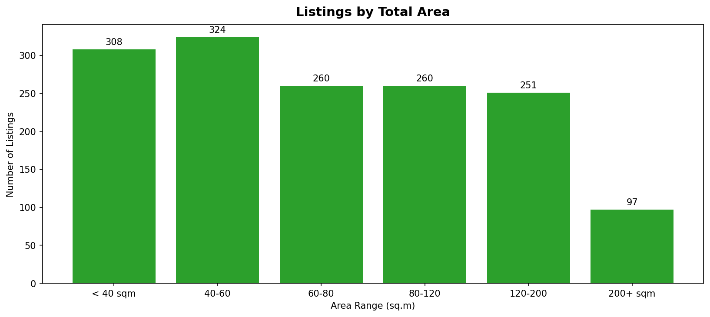

The 40–80 sqm range accounts for the largest share of listings — consistent with the dominance of 1-3 room apartments. A meaningful tail of 120–200+ sqm luxury units serves the premium segment.

**Business implication:**
Renovation, staging, and furnishing businesses should calibrate service packages for the 40-80 sqm sweet spot. Premium interior design services should be positioned for 120+ sqm units tied to the high-floor, luxury building segment.

---

## 9. Mortgage — Who Can Access Financing

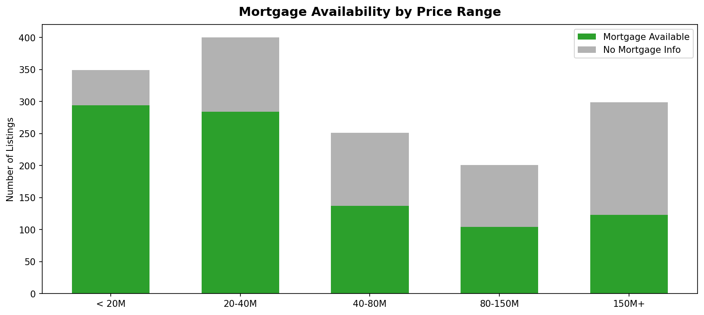

Mortgage availability is concentrated in listings below 80M RUB. Above that level, mortgage tagging drops sharply — the upper market is effectively a cash-only segment.

- Sub-20M: 87% mortgage-eligible
- 20-40M: 74% mortgage-eligible
- 40-80M: 56% mortgage-eligible
- 80-150M: 26% mortgage-eligible
- 150M+: negligible mortgage availability

**Business implication:**
Mortgage lenders have a clear, defensible addressable market below 80M RUB. Above this threshold, private banking, structured finance, and instalment products are the relevant tools. The financing gap in the 80-150M segment is a business opportunity for non-standard lending products.

---

## Key Decision-Making Summary

| Finding | Recommended Action |
|---|---|
| 2-3 room units dominate supply | Target product development and marketing toward family-sized units |
| Median price 40M vs mean 97M RUB | Strip ultra-premium outliers from market benchmarks; they distort pricing |
| Panel buildings trade at 54% discount to monolith | Apply strict material-based LTV caps in lending; avoid panel as collateral at standard rates |
| 67% free-sale transactions | Secondary market expertise is the core competency; invest in it |
| Ground floor listings are deeply discounted | Avoid ground-floor collateral; clients should negotiate hard on ground-floor purchases |
| Mortgage eligibility drops above 80M RUB | Launch non-standard products (instalment plans, private banking) for the 80-300M segment |
| Skyscraper (21+) floors command 3x ground floor prices | High-floor new builds are a defensible premium product; underwrite accordingly |
